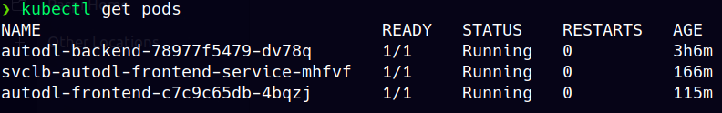
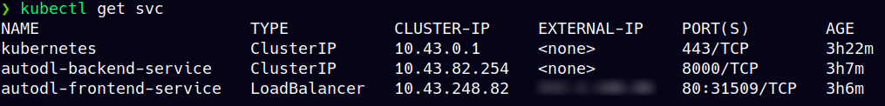

# k8s-deployment


[](https://join.slack.com/t/autodl/shared_invite/zt-qagxiwub-ywRM_oBvvF~F7YNtlBqy_Q)
[](code_of_conduct.md)

Kubernetes configuration for deployment of Auto-DL.

## How to deploy

1. Configure the `host` in `k8s/ingress.yml` and `env` variables in `k8s/*-deployment.yaml`
2. Apply all the `yaml` configuration using `kubectl`
```sh
cd k8s/
kubectl apply -f backend-deployment.yaml
kubectl apply -f backend-service.yaml
kubectl apply -f frontend-deployment.yaml
kubectl apply -f frontnend-service.yaml
kubectl apply -f ingress.yaml
```
3. Check the status of the `pods` and `services`


4. You have a working [Auto-DL](https://github.com/Auto-DL/Auto-DL) deployment :tada:

> **Note:** Install [kubeval](https://kubeval.instrumenta.dev/installation/) to run the pre-commit hooks for validating the k8s yaml configuration.
